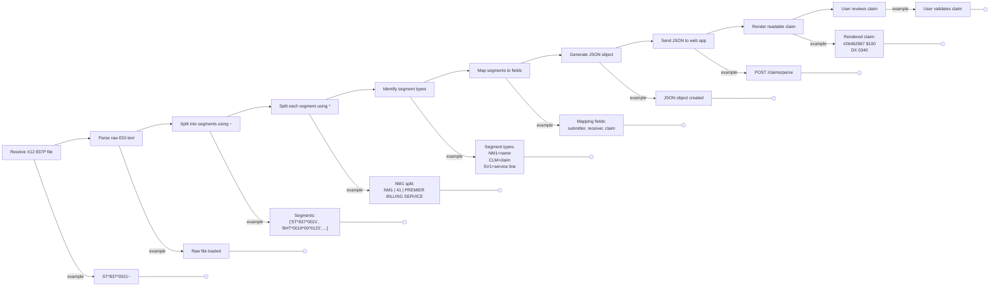

```mermaid
flowchart LR

    %% MAIN FLOW
    A[Receive X12 837P file] --> B[Parse raw EDI text]
    B --> C[Split into segments using ~]
    C --> D[Split each segment using *]
    D --> E[Identify segment types]
    E --> F[Map segments to fields]
    F --> G[Generate JSON object]
    G --> H[Send JSON to web app]
    H --> I[Render readable claim]
    I --> J[User reviews claim]

    %% --- INLINE EXAMPLES (POP-OUT BOXES NEXT TO EACH STEP) ---
    A -->|example| Aex["ST*837*0021~"]
    B -->|example| Bex["Raw file loaded"]
    C -->|example| Cex["Segments:\n['ST*837*0021', 'BHT*0019*00*0123', ...]"]
    D -->|example| Dex["NM1 split:\nNM1 | 41 | PREMIER BILLING SERVICE"]
    E -->|example| Eex["Segment types:\nNM1=name\nCLM=claim\nSV1=service line"]
    F -->|example| Fex["Mapping fields:\nsubmitter, receiver, claim"]
    G -->|example| Gex["JSON object created"]
    H -->|example| Hex["POST /claims/parse"]
    I -->|example| Iex["Rendered claim:\n#26462967  $100\nDX 0340"]
    J -->|example| Jex["User validates claim"]

    %% FORCE EXAMPLES TO THE RIGHT USING INVISIBLE ANCHOR POINTS
    Aex --- X1(( ))
    Bex --- X2(( ))
    Cex --- X3(( ))
    Dex --- X4(( ))
    Eex --- X5(( ))
    Fex --- X6(( ))
    Gex --- X7(( ))
    Hex --- X8(( ))
    Iex --- X9(( ))
    Jex --- X10(( ))
```
