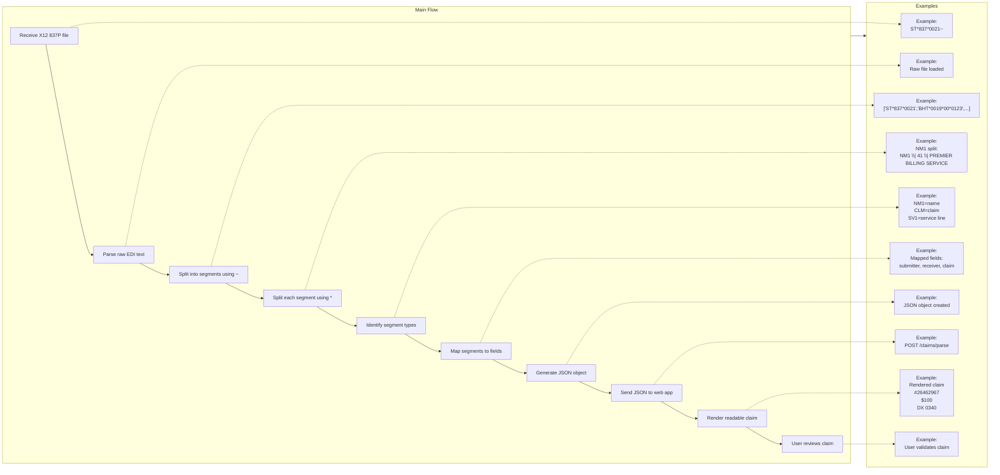

```mermaid
flowchart LR

    %% LEFT COLUMN — MAIN FLOW
    subgraph LEFT[Main Flow]
        A[Receive X12 837P file] --> B[Parse raw EDI text]
        B --> C[Split into segments using ~]
        C --> D[Split each segment using *]
        D --> E[Identify segment types]
        E --> F[Map segments to fields]
        F --> G[Generate JSON object]
        G --> H[Send JSON to web app]
        H --> I[Render readable claim]
        I --> J[User reviews claim]
    end

    %% RIGHT COLUMN — EXAMPLES
    subgraph RIGHT[Examples]
        Aex["Example:\nST*837*0021~"]
        Bex["Example:\nRaw file loaded"]
        Cex["Example:\n['ST*837*0021','BHT*0019*00*0123',...]"]
        Dex["Example:\nNM1 split:\nNM1 \\| 41 \\| PREMIER BILLING SERVICE"]
        Eex["Example:\nNM1=name\nCLM=claim\nSV1=service line"]
        Fex["Example:\nMapped fields:\nsubmitter, receiver, claim"]
        Gex["Example:\nJSON object created"]
        Hex["Example:\nPOST /claims/parse"]
        Iex["Example:\nRendered claim\n#26462967\n$100\nDX 0340"]
        Jex["Example:\nUser validates claim"]
    end

    %% POSITION RIGHT SUBGRAPH NEXT TO LEFT SUBGRAPH
    LEFT --> RIGHT

    %% CONNECT EACH STEP TO ITS EXAMPLE (dotted arrows)
    A -.-> Aex
    B -.-> Bex
    C -.-> Cex
    D -.-> Dex
    E -.-> Eex
    F -.-> Fex
    G -.-> Gex
    H -.-> Hex
    I -.-> Iex
    J -.-> Jex
```
