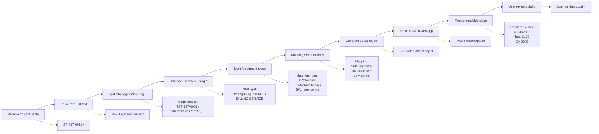

```mermaid
flowchart LR

    %% LEFT SIDE MAIN FLOW
    A[Receive X12 837P file] --> B
    B[Parse raw EDI text] --> C
    C[Split into segments using ~] --> D
    D[Split each segment using *] --> E
    E[Identify segment types] --> F
    F[Map segments to fields] --> G
    G[Generate JSON object] --> H
    H[Send JSON to web app] --> I
    I[Render readable claim] --> J
    J[User reviews claim]

    %% RIGHT SIDE EXAMPLES
    Aex["ST*837*0021~"]
    Bex["Raw file loaded as text"]
    Cex["Segments list:\n['ST*837*0021', 'BHT*0019*00*0123', ...]"]
    Dex["NM1 split:\nNM1 \\| 41 \\| PREMIER BILLING SERVICE"]
    Eex["Segment roles:\nNM1=name\nCLM=claim header\nSV1=service line"]
    Fex["Mapping:\nNM1=submitter\nNM1=receiver\nCLM=claim"]
    Gex["Generated JSON object"]
    Hex["POST /claims/parse"]
    Iex["Rendered claim:\n#26462967\nTotal $100\nDX 0340"]
    Jex["User validates claim"]

    %% CONNECTION ARROWS
    A -.-> Aex
    B -.-> Bex
    C -.-> Cex
    D -.-> Dex
    E -.-> Eex
    F -.-> Fex
    G -.-> Gex
    H -.-> Hex
    I -.-> Iex
    J -.-> Jex
```
