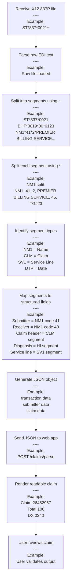

```mermaid
flowchart TB

A[Receive X12 837P file
----
Example:
ST*837*0021~] --> B

B[Parse raw EDI text
----
Example:
Raw file loaded] --> C

C[Split into segments using ~
----
Example:
ST*837*0021
BHT*0019*00*0123
NM1*41*2*PREMIER BILLING SERVICE...] --> D

D[Split each segment using *
----
Example:
NM1 split:
NM1, 41, 2, PREMIER BILLING SERVICE, 46, TGJ23] --> E

E[Identify segment types
----
Example:
NM1 = Name
CLM = Claim
SV1 = Service Line
DTP = Date] --> F

F[Map segments to structured fields
----
Example:
Submitter = NM1 code 41
Receiver = NM1 code 40
Claim header = CLM segment
Diagnosis = HI segment
Service line = SV1 segment] --> G

G[Generate JSON object
----
Example:
transaction data
submitter data
claim data] --> H

H[Send JSON to web app
----
Example:
POST /claims/parse] --> I

I[Render readable claim
----
Example:
Claim 26462967
Total 100
DX 0340] --> J

J[User reviews claim
----
Example:
User validates output]
```
